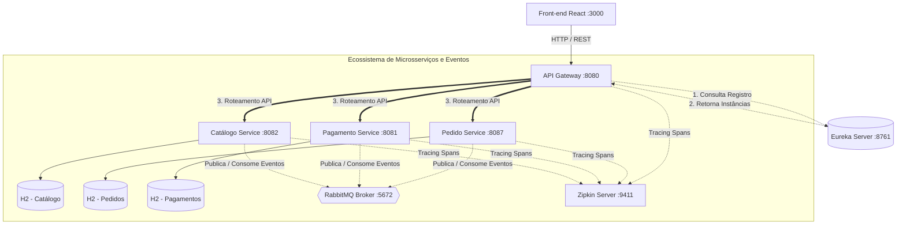
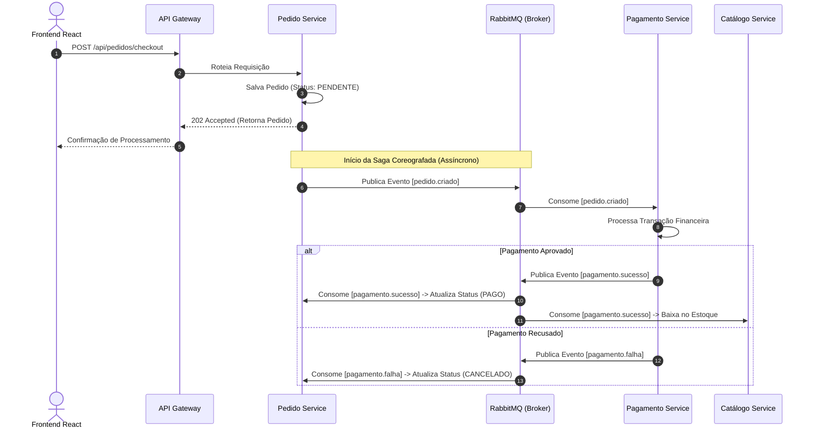
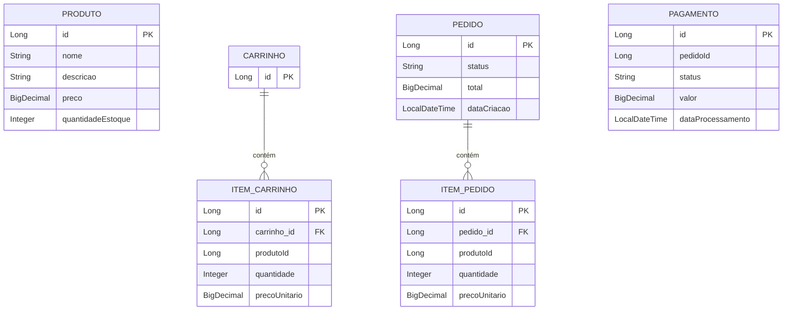

# 🛒 E-Commerce Distributed Platform (Event-Driven Microservices Architecture)

Uma plataforma de e-commerce completa construída sobre uma **Arquitetura de Microsserviços Orientada a Eventos**. O ecossistema inclui um **API Gateway**, **Service Discovery**, **Saga Coreografada** via mensageria, rastreamento distribuído fim a fim e automação completa de build e testes.

---

## 🛠️ Stack Tecnológica

### **Back-end & Infraestrutura**
* **Linguagem & Framework:** Java 21 | Spring Boot 3.3
* **Edge & Discovery:** Spring Cloud Gateway (Roteamento e CORS) | Spring Cloud Netflix Eureka (Service Registry)
* **Mensageria & Saga:** RabbitMQ (AMQP Broker) com suporte a compensações automáticas
* **Observabilidade & Tracing:** Micrometer Tracing + Brave | OpenZipkin Server
* **Persistência:** H2 Database (Isolado por serviço com inicialização automatizada de estado no Pedido Service) | Spring Data JPA
* **Qualidade & Testes:** JUnit 5 | Mockito | `@WebMvcTest`
* **Contentorização:** Docker | Docker Compose (Multi-stage builds)
* **CI/CD:** GitHub Actions (Automated Build & Test Pipeline)

### **Front-end**
* **Framework:** React.js (Empacotado com Nginx no Docker)
* **Comunicação:** REST API consumida exclusivamente via API Gateway

---

## 🏛️ Arquitetura e Padrões de Design

A aplicação implementa **Domain-Driven Design (DDD)** e desacoplamento total de dados. O tráfego do cliente não acede diretamente aos microsserviços internos, passando obrigatoriamente pela camada de borda (API Gateway).

### **Padrões Chave:**
1. **Choreographed Saga Pattern:** Transações distribuídas (Checkout -> Pagamento -> Baixa de Estoque) são coordenadas de forma assíncrona por eventos no RabbitMQ, sem um orquestrador central. Em caso de falha de pagamento, um evento de compensação cancela o pedido automaticamente.
2. **Database per Service:** Cada domínio (Catálogo, Pedido, Pagamento) possui o seu próprio banco de dados isolado em memória, garantindo autonomia funcional.
3. **Distributed Tracing:** Toda requisição ganha um `TraceId` e `SpanId` propagados entre chamadas HTTP e eventos RabbitMQ, permitindo auditoria visual no Zipkin.

---

## 📊 Diagramas da Arquitetura

### 1. Diagrama de Componentes e Infraestrutura

