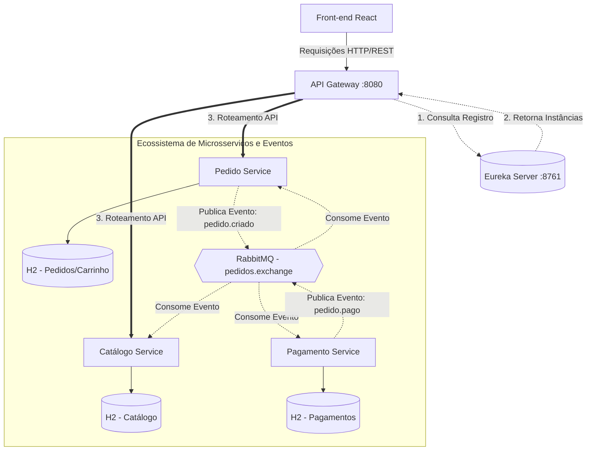
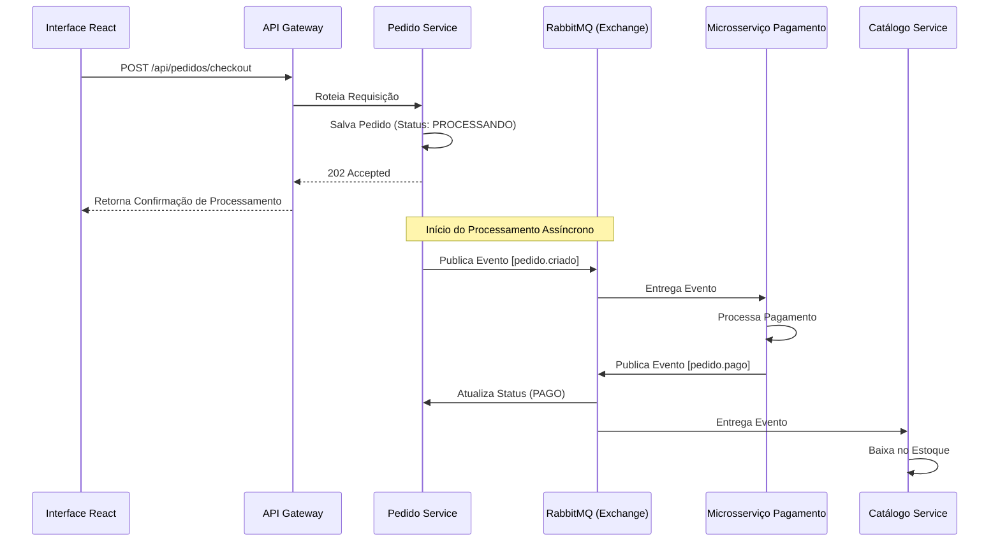
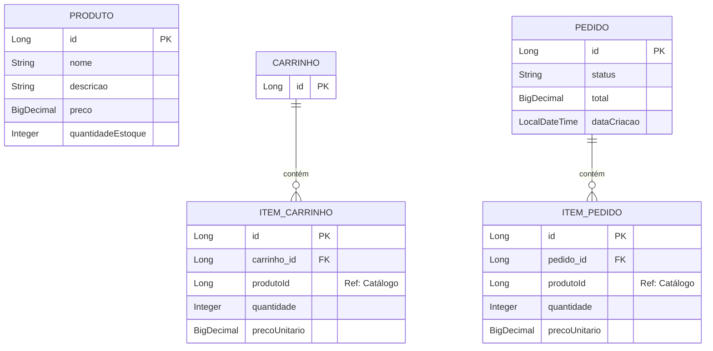

# 🛒 Plataforma de E-commerce (Arquitetura de Microsserviços)

Este projeto é uma plataforma de E-commerce Full-Stack desenvolvida utilizando **Java com Spring Boot** no Back-end e **React** no Front-end.

O sistema passou por uma profunda evolução arquitetural, saindo de um monolito modular (DDD) para uma **Arquitetura de Microsserviços Distribuída**. A infraestrutura agora conta com um **API Gateway** centralizado e um **Service Discovery** (Registro de Serviços), garantindo escalabilidade, resiliência e roteamento dinâmico para os domínios de Catálogo, Pedidos e Pagamentos.

## 🚀 Tecnologias Utilizadas

**Back-end (Ecossistema Spring Cloud & Boot):**
* Java 21+
* Spring Boot (Web, WebFlux, Data JPA, Validation)
* **Spring Cloud Gateway** (Roteamento Reativo, Load Balancer e Gestão Global de CORS)
* **Spring Cloud Netflix Eureka** (Service Registry & Discovery)
* **Spring Cloud OpenFeign** (Comunicação Síncrona entre Microsserviços)
* Banco de Dados em Memória (H2) isolado por serviço
* Hibernate Envers (Auditoria/Histórico)
* Lombok (Redução de boilerplate)
* JUnit 5 & Mockito (Testes Unitários e de Integração)

**Front-end:**
* React.js
* Fetch API para consumo centralizado através do API Gateway

---

## 🏛️ Arquitetura e Padrões de Projeto

A aplicação foi desenhada aplicando conceitos de **Domain-Driven Design (DDD)** e arquitetura de microsserviços. O tráfego do front-end não acessa mais os serviços diretamente, passando por uma camada de borda (Edge Layer).

### Infraestrutura e Microsserviços

1. **Service Discovery - Eureka Server (Porta 8761):**
    * Atua como o catálogo da rede. Todos os microsserviços se registram aqui ao iniciar.
2. **API Gateway (Porta 8080):**
    * Ponto de entrada único da aplicação (BFF - Backend for Frontend).
    * Construído com Spring WebFlux (Netty).
    * Resolve problemas de Cross-Origin (CORS) globalmente.
    * Roteia dinamicamente as requisições (`/api/produtos`, `/api/pedidos`, etc.) e faz o balanceamento de carga consultando o Eureka (`lb://NOME-DO-SERVICO`).
3. **Catálogo Service:**
    * Gerencia os produtos e o estoque.
4. **Pedido Service (Carrinho e Pedidos):**
    * Gerencia a sessão de compras do usuário e o processo de checkout.
5. **Microsserviço de Pagamentos:**
    * Serviço isolado responsável pela aprovação da transação financeira. A comunicação entre o serviço de Pedido e o de Pagamento ocorre internamente via **OpenFeign**.

Cada microsserviço segue o padrão Clean Code/SOLID com design em 3 camadas (Controllers, Services, Repositories).

---

## 🗄️ Persistência e Auditoria

* **Banco de Dados por Microsserviço:** Cada serviço possui seu próprio banco **H2** isolado, respeitando o padrão de dados distribuídos.
* **Auditoria:** Utiliza **Spring Data JPA** e **Hibernate Envers** (`@Audited`) para rastrear o histórico de alterações no banco (como variações de preço e mudança de status do pedido).
---

## ⚙️ Como Executar o Projeto

Para rodar a aplicação localmente, certifique-se de ter instalado: **Java 21**, **Maven**, **Node.js/npm** e o **RabbitMQ** (pode ser rodado via Docker).

### Passo a Passo de Inicialização

A ordem de inicialização dos serviços é crucial para que o registro e o roteamento funcionem corretamente.

1. **Infraestrutura Base:**
    * Inicie o servidor do **RabbitMQ** (porta padrão 5672).
    * Inicie o **Eureka Server** (Service Discovery) e aguarde estar disponível em `http://localhost:8761`.

2. **Microsserviços Core:**
    * Inicie o `catalogo-service` (porta 8088).
    * Inicie o `pedido-service` (porta 8087).
    * Inicie o `pagamento-service` (se aplicável, porta 8081).
    * *Aguarde cerca de 30 segundos para que todos os serviços apareçam registrados no painel do Eureka.*

3. **API Gateway:**
    * Inicie o `api-gateway` (porta 8080). Ele fará o download das instâncias disponíveis no Eureka.

4. **Front-end (React):**
    * Navegue até a pasta do frontend.
    * Execute `npm install` (caso seja a primeira vez).
    * Execute `npm start` para rodar a aplicação na porta `3000`.

---

## 📊 Diagramas de Arquitetura

Os diagramas abaixo ilustram o design distribuído, agora focado em uma **Arquitetura Orientada a Eventos (Event-Driven)** para garantir o desacoplamento total dos domínios.

### Diagrama de Componentes (Infraestrutura e Mensageria)

